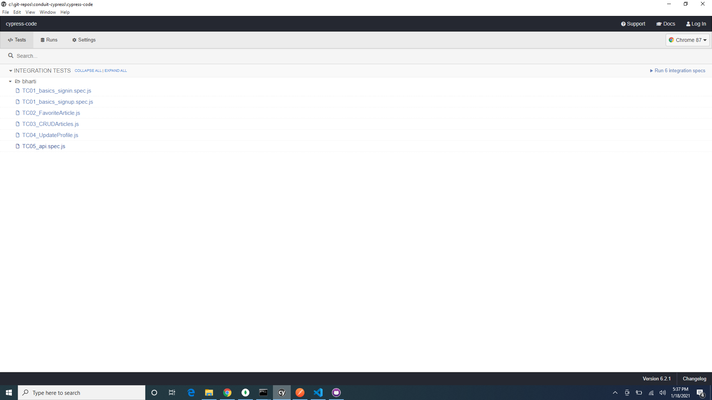

# conduit-cypress

In order to run the cypress test, please follow the instructions mentioned in https://docs.google.com/document/d/1qOJHeQyn_inm48ttbsdM4kUirbrEf5v5E0dMg5N-99Q/edit to setup frontend and backend application and then clone this repo.

once both applications are setup and running, and repo is cloned, please go to cypress-code directory and run "npx cypress open" and then run the tests starting with "sign-up".

All the cypress tests are inside below directory

cypress-code/cypress/integration/bharti

